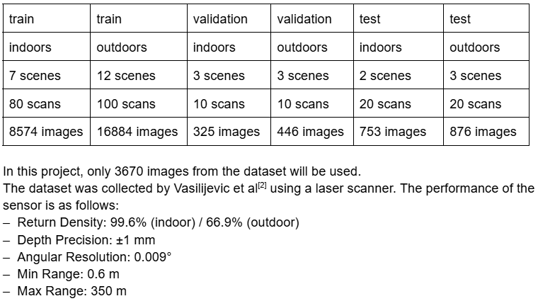
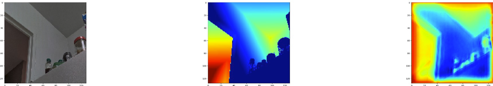

## Predicting the shape of a photographed object using AI

Have you ever wondered if robots can know the shape of the world around them from a single camera in a similar way to how we know how far things are? Well, this project aims to develop a simple AI algorithm that can do that.

This project used an open source dataset named **[Diode Dataset](https://diode-dataset.org/)** where there are depth maps associated with images. 

For this project based on computing limitations, only the validation and test images were used.

Some pre-processing was done, which is described below:

-The top 5% and bottom 5% of depth values are clipped.
-The data is then scaled to be in the range [0,1]
-The natural log of the pixel values + 0.05 is taken.
-The data is scaled again to be in the range [0,1]
-Image resolution was decreased from 1024x784 into 256x192.

For this project, a Convolutional Neural Network with less than 500,000 parameters was used, this was with the purpose to widen the application scopes of this model. Although the algorithm was able to predict general shapes at its best, more work is needed in order to apply it as a solution for computer vision.

Although this specific example had a good prediction of shape, most images produced noisier predictions.
