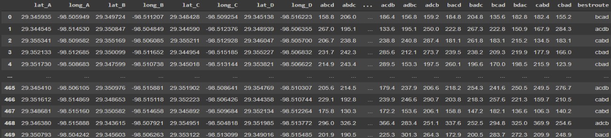
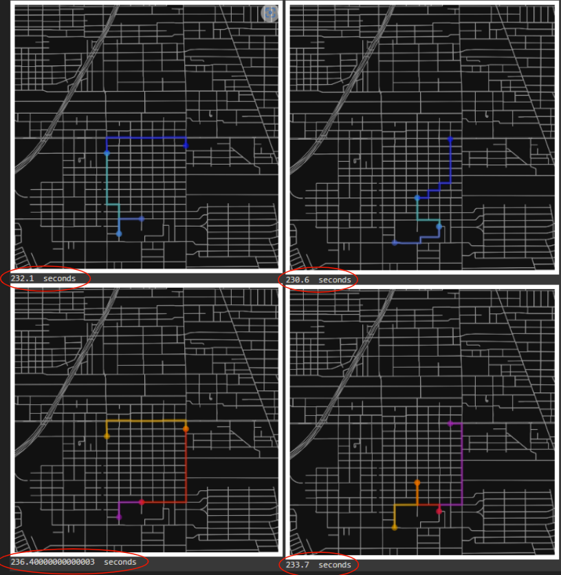

## Finding the best route between several points using AI

If an Amazon/UPS/FedEx driver wants to deliver goods to 2 homes, how many different routes are possible, and how do you find the best one? Answer: 2 routes determined by trial and error. Having 20 homes increases the possible routes to 2,432,902,008,176,640,000, which is too much to do with trial and error. This is a really important problem to solve because it would massively reduce gasoline usage around the world. It isn’t logical to do trial and error if we have a lot of homes, so I took a different approach: Making an AI model that can predict (or get close to) what would be the best route from the coordinates.

This was done on a small scale since it would take a long time for my computer to generate a dataset to train the AI with many homes. The data was made by plugging random coordinates (in San Antonio Texas as a small-scale test) into a Python program called Open Street Maps that generates travel times for a route between 2 points in the map, this was done with 4 points (12 times in total since the order was ignored: 4!/2). 

The tests done on the data were convincing since a Random Forest AI model was able to correctly guess approximately 40% of the routes, and on average, was 10% longer than the perfect route (compared to 40% longer for random routes). This test was able to show that AI can be used to approximate a generally close answer in problems that would otherwise require a lot of computing.

