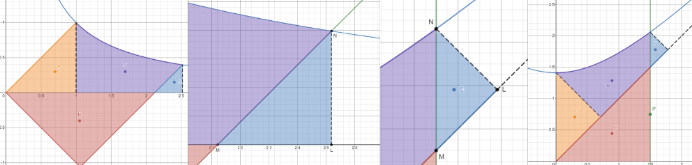
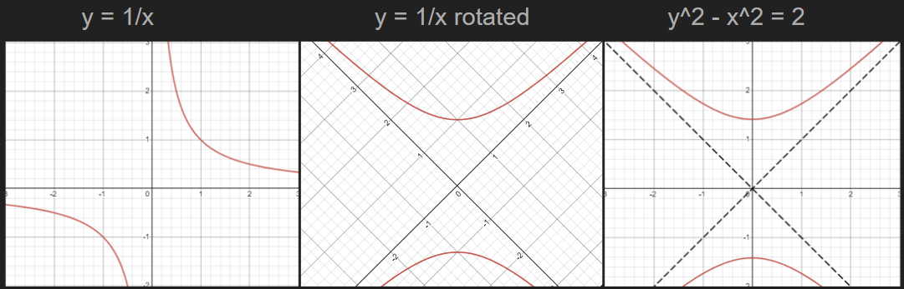
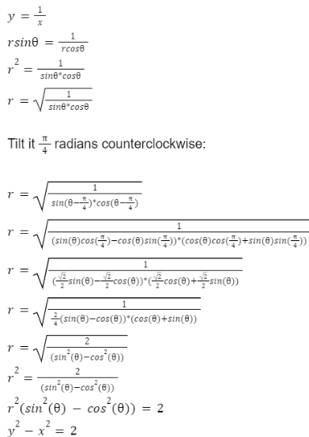
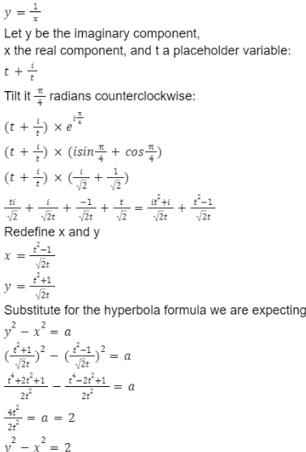
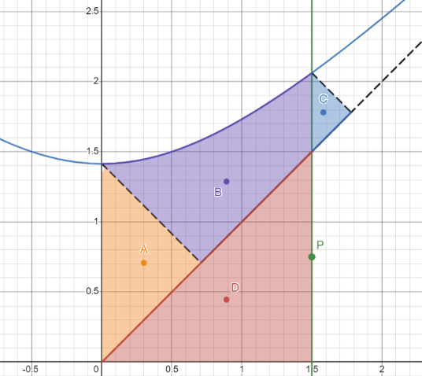
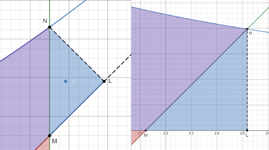
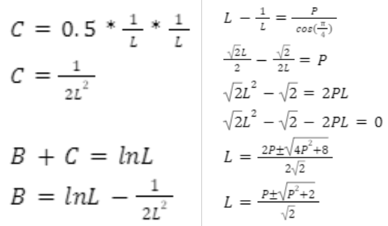
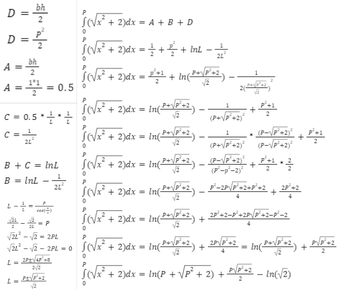

## Finding the area under a hyperbola using rotations.

By only knowing that the integral of 1/x is ln|x| and how to use polar equations (or Euler’s formula), it is possible to find the integral of a hyperbola. This isn’t normally seen up until Calculus II. The Integral (Area under the curve) of y^2 - x^2 = 2 was calculated through the 45° rotation of a y=1/x graph and finding the areas composing it on the graph. This approach clearly shows why the area under a hyperbola depends on a natural logarithm and other properties it has. **[Here is an interactive representation of this process](https://www.desmos.com/calculator/0qavllu7bp)**

Hyperbolas are interesting shapes, but it is initially quite hard to know how to work with them, especially when integrating. Here I show an alternative method for finding the integral of a hyperbola using first-month knowledge of high school Calculus. First, we start by proving that y = 1/x is a hyperbola. We will define a hyperbola as one having the general form: y^2 - x^2 = a. This can be done with polar equations or with Euler’s formula. In this case, I will show how to do it both ways to demonstrate how it can be done quickly or with basic knowledge.

This example uses polar coordinates to rotate a y = 1/x graph 45° or π/4 angle and arriving to y^2 - x^2 = 2

::: {.grid}
::: {.g-col-6}

:::
::: {.g-col-6}
 |
:::
:::

**Calculating the specific areas:**

From the figure below, we can see two lines: one passing through y=x and another one labeled P.  There are four areas labeled A, B, C, and D, these areas can be calculated through different equations. First, let's solve the easiest ones: A and D.

A stays constant since it represents a triangle made from an isosceles triangle with a base and height of 1, which doesn’t depend on the position of line P.

The Area of D is ½P^2 since the triangle has a base and height equal to P.

To get the other two areas, we need to define the line going from 0,0 to the right-most corner of the triangle C as a new axis L. L has the length of the base of the original y=1x graph used, which allows us to get the area of that shape using a natural logarithm. The image below shows the point where L is measured from.

Based on the image above. Area C, having a base on the x-axis in the original y = 1/x graph, makes it easier to calculate in terms of L for the rotated graph. We know that in the original y = 1/x graph the height of the triangle is y and it was formed by a 45° or π/4 angle, meaning that both lines LM and LN have the same length. Knowing that LN = y,  we can determine the area to be equal to ½(1/L)^2 since both the base and height in the rotated triangle need to be 1/L.

We also need to consider that L doesn’t lie exactly on P, meaning that we need to remove the segment LM from length L to get length P. Thankfully, we already know what LM is, meaning that we can create a formula to calculate P based on L. Using the quadratic formula, we can solve for L, giving us the last step in finding the integral of the hyperbola. We are using the positive variation in the quadratic formula since we will not account for the negative y-values on the graph.

After getting all of the formulas needed, it is now just adding them together. Note that the formula we are using is y = √(x^2+2), this was done because y^2 - x^2 = 2 is not a function, but it does graph the same curve for positive y values.

