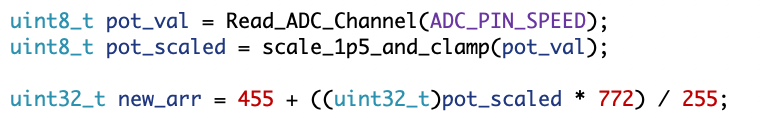
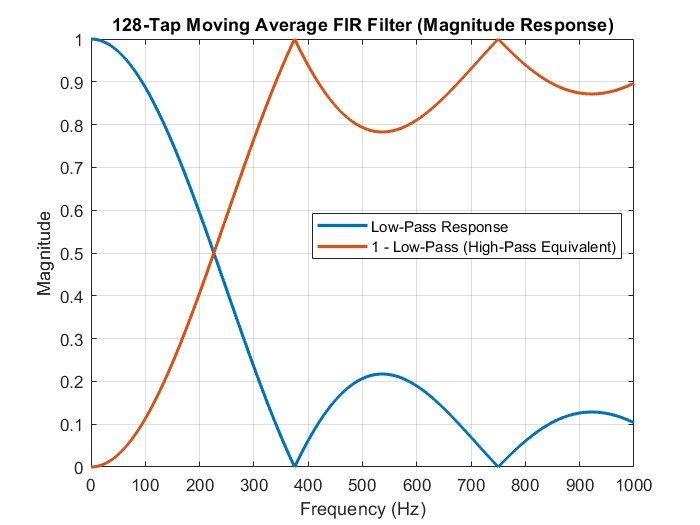

After working in this project for over a hundred hours, we were able to get continuous playback out of the SD card while being able to skip forward to the next song, adjust the filter and speed, and be user friendly. 



## Formulas for Performance

Using a Moving Average filter as the lowpass filter was probably not an ideal choice, but its simplicity and results were good. This filter should have a "corner frequency" of around 165 Hz, done with the formula:

$$
\frac{48{,}000 \times 0.441}{128} = 165.4\ \text{Hz}
$$

Another consideration is the maximun and minimum playing speeds, in our case, we chose to use the following value, where the ADC value goes from 0 - 255;

$$
455 + 772 = 1217
$$
This means we have a frequency of 
$$
80,000,000/(1218) = 65681Hz
$$
which means our playback speed is 32840Hz, or 68.4% of the original sampling rate.
Using the minimum ARR of 455, we get a playing speed of;
$$
80,000,000/(455) = 175824Hz
$$
which means our playback speed is 87912Hz, or 183.2% of the original sampling rate.

Going faster than this showed issues because of how fast SPI transfers data, which could be optimized, but audio at 183% playback speed is already really high pitch. 

The FIR filter chosen should have the following frequency response:

