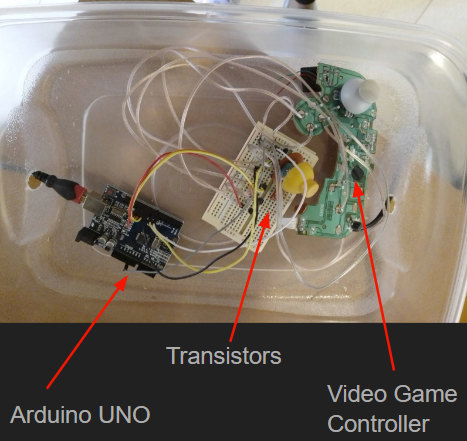
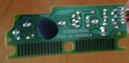
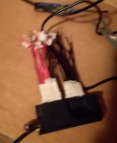
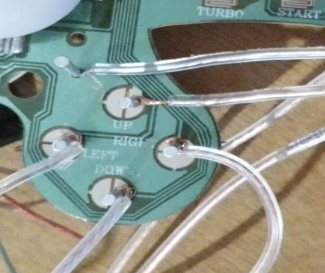

## Controlling device inputs with a microcontroller

Have you ever wondered if it is possible to make a non-mechanical device that presses keys/buttons for you? Well, this is a question I had some time ago, which inspired me to test it on a video game controller, and eventually, a keyboard. The system here connects the circuit in a controller to some transistors using nails. The transistors can be switched on and off with the use of a microcontroller, which in this case is an Arduino Uno. The system done with the controller worked well and was able to be programmed. The project then started using a keyboard instead of a controller, which was proven to work. I was limited by the microcontroller I had available because the keyboard circuit had more terminals than the Arduino, meaning that not all letters and symbols could be simulated.

### Original circuit of a computer keyboard.
This circuit worked in an interesting way, where terminals were either type A or B (8A and 18B in total). A and B are able to combine to create different key presses, adding to 144 different possible keys (including letters, symbols, turning your computer off, and more). One interesting hidden key printed the current date and time in just one press. The explanation of how this works explains why when you press “a” and “d” at the same time it will no longer detect when you press “c” (this may vary from keyboard to keyboard), but it does detect when you press “h”. This is because “a” and ”d”, already include the combinations which “c” needs to be detected by the computer (“a” may have the same A terminal than “c” while “d” has the same B terminal as “c”, meaning that pressing “c” doesn’t connect anything that wasn’t connected before).

### Connecting wires to keyboard PCB
Here is the set up used to connect the keyboard circuit. Note that there are a lot of wires coming out of this device when compared to the controller. In this setup, red wires are A type while black wires are B type.

### Connecting wires to controller PCB
Here is a closer look at the connections made with nails to the controller circuit. These connections only worked because the PCB is single layered. Overall these connections were effective for connecting the plates without the use of soldering since soldering frequently broke off the flat surface.

## Software integration
Although the keyboard setup showed difficulty to get consistent connections since connections were not soldered, it was proven to work with a pedal to be used as a custom controller for PC gaming.

On the other hand, the controller setup was able to be programmed to press buttons in a specific order with a specific time delay, the best proof of concept was using this setup for games that require lost of inputs per second, which prooved to be way faster than any result I was humanly able to achieve.