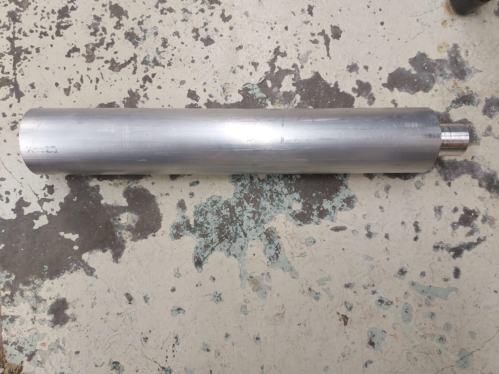
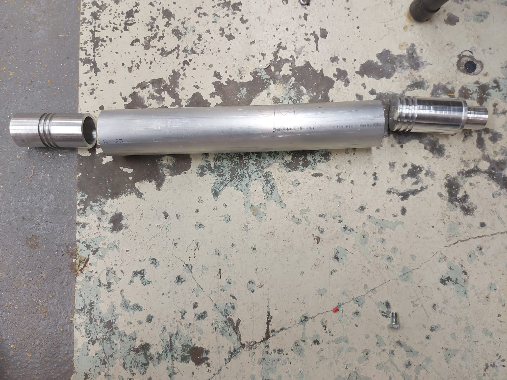
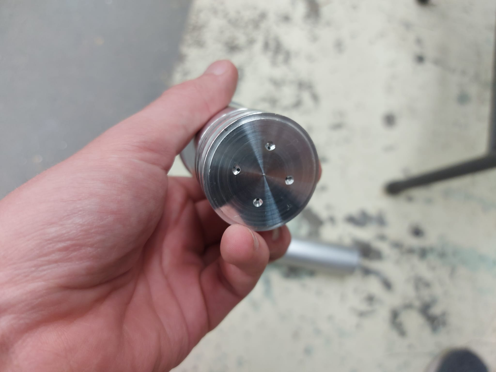

## Hybrid Rocket Engine

Currently designing and buiding a small hybrid rocket engine that uses a 3D-printed fuel grain and Nitrous Oxide as a propellant. Using a hybrid engine isn't as efficeint as solid or liquid, but it is safer to handle and not as complicated as a liquid engine. This would allow the college to start building rocket engines of different sizes and specifications that could be used for multiple projects.

Here are some pictures of the engine itself, we are still working in plumbing and possibly modifying the injector to be more customizable.

Here is a picture of the injector, we are currently planning to change having 4 holes for a threaded hole that we can chnage the injector for different tests. This would help make a testing matrix that would allow us to find a simple and efficient design we can upscale.

