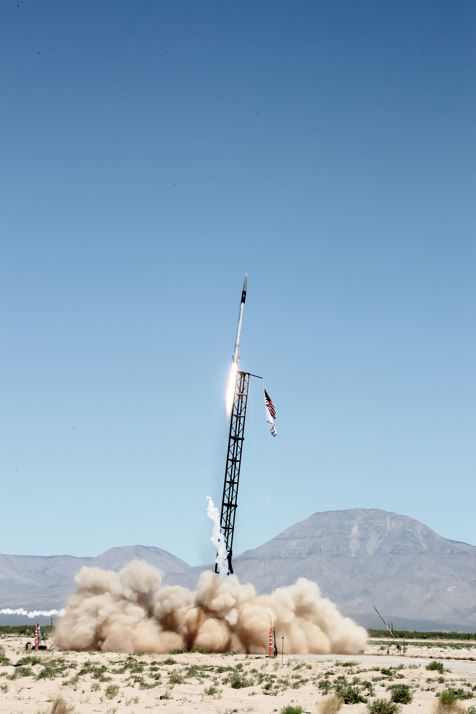
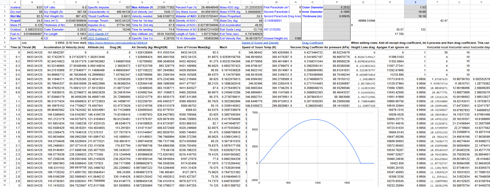
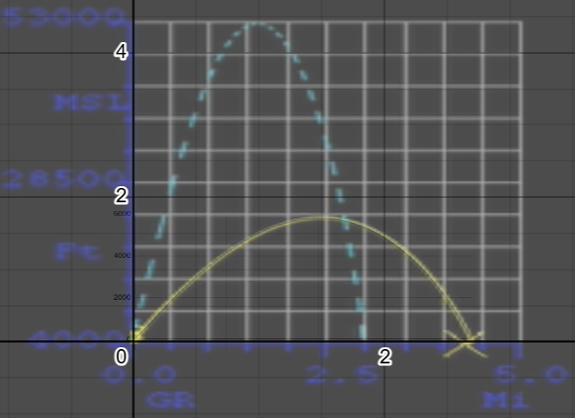
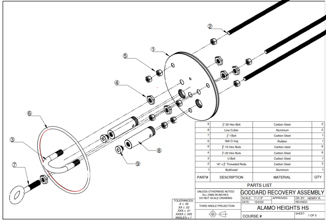

## Hybrid Rocket

While on Alamo Heights High School, I joined the rocketry program and worked in a project to design, build, and test a hybrid rocket. 
The goal was to build a hybrid rocket capable of reaching 50,000 ft while having a 5 lb payload and safely recovering it. This is not an easy task, but we were able to build a rocket and test it at White Sands Missile Range.

The first step was to simulate the flight and make sure the general shape and size of the rocket would be able to meet our objectives, here is a picture of the simulation we ran on Google Sheets using Euler's method in order to predict where the rocket would end up in (Disclaimer: this simulation was modified post flight to match flight data we got, mainly as a test of the efficacy of the simulation algorithm)

This algorithm was compared to the actual flight after we added specific values from the flight in order to calculate the efficiency of the engine (Isp). This next image has a yellow line representing the actual flight path of the rocket, and there is an overlapping blue line that is what we simulated. Using the specific angle the rocket went, how high it went, and how far it landed (crashed), we determined that the Isp was around 157 seconds. We also assumed constant wind speeds for this result, but we have checked that modifying these would have minimal impact (whithin reasonable range). Another issue the rocket had is that the tank was only half full (or half empty), meaning that we also had to account for this in these simulations post flight analysis. 

Although all of this simulation was really interesting, we can now talk about the subsystem I was mainly involved in: Recovery (I think this was spoiled before, but the rocket crashed). Altough the rocket crashed, it is unclear if it was the avionics or recovery that failed, but it is more likely it would have been the avionics since not even the nosecone was able to deploy, which should be directly liable on the avionics. All of this was analysed post flight and noted for the next year in the project, where they were able to get a working recovery system. At the end of the day, having a system you can't fully test work first time is difficult. Here is a short overview of the recovery system:

This system consisted of a dual deployment using only 1 parachute. Although we only have 1 parachute, we can make it act like 2 different sizes by using a technique called reefing, where we tie down the parachute so it is closed when it is deployed. This helps since it acts like a smaller parachute and then we can cut this line using our custom designed and built line cutters to fully open them. For this, we tested the line cutters before flight, which we can see in the video below:

Finally, this recovery system and the other components of the rocket were integrated, amking sure they all worked together in order to achieve the video shown, The rocket was 63kg dry mass and 95kg wet mass (with fuel and oxidizer), although designed to be 113kg: The rocket reached a total altitude over ground level of 18994 feet (5774 meters).

