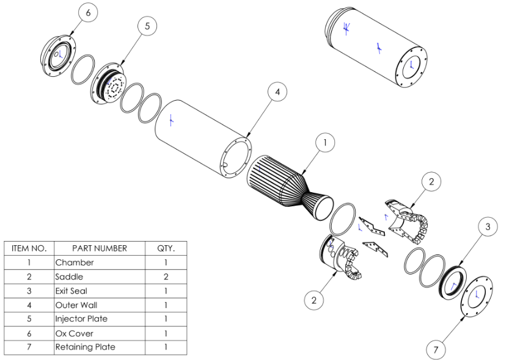
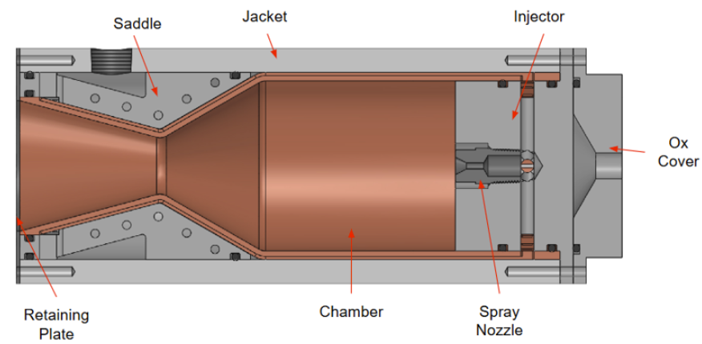
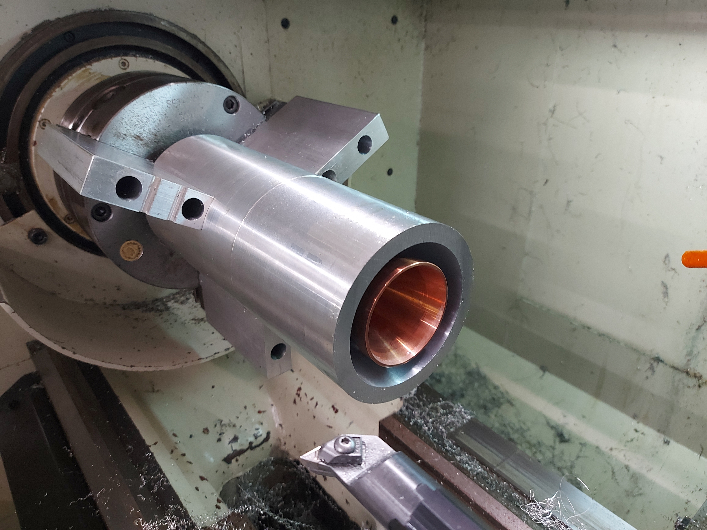
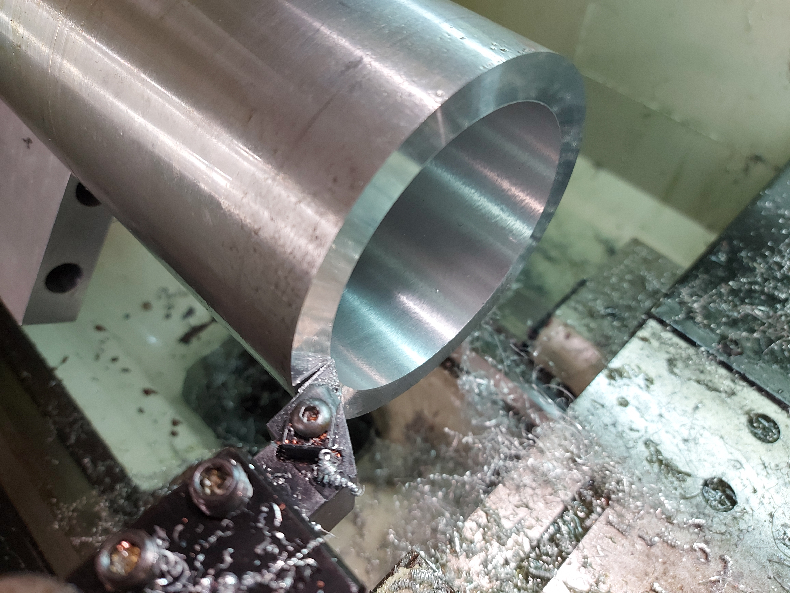
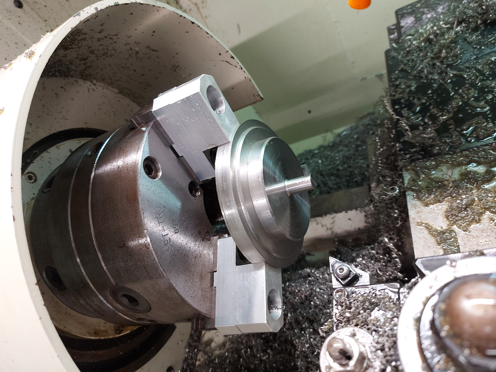
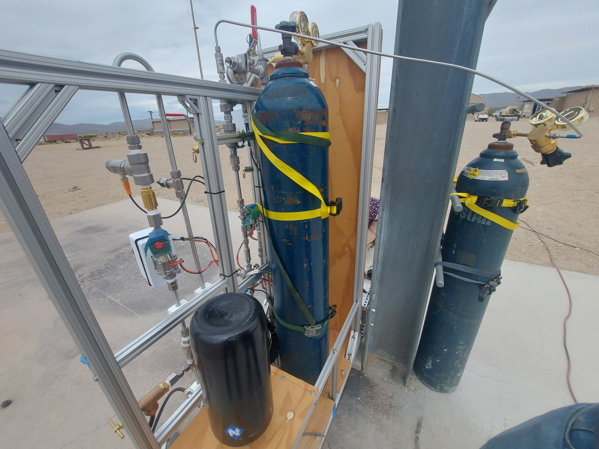
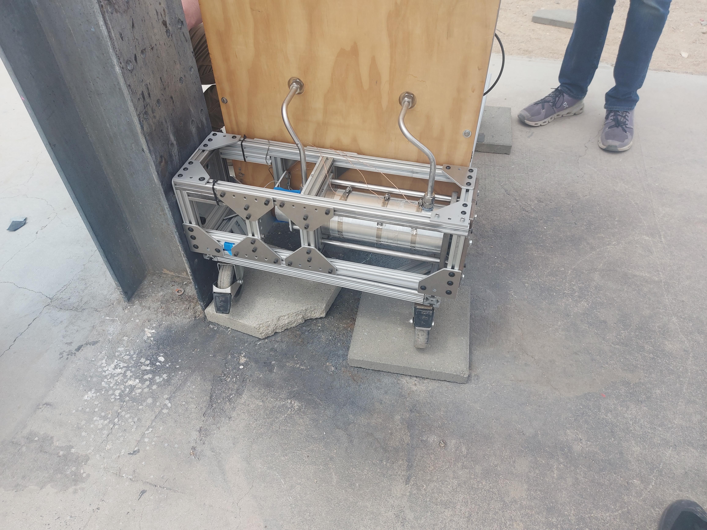

## Liquid Rocket Engine

Liquid engines are generally considered to be the best ones for rocketry. This student runned project at HMC was tasked to test one. In this project, I mainly helped machine, create the electronics systems, and fix any unexpected flaws that arose as we continued to make the engine. 

First of all, thsi project has been going for 3 years, this means that the design was done while I was still in High School. For understanding purposes I will add pictures of this, but I wasn't involved with this design:

On the other hand, most of these parts were not machined when I joined. Here are some images of the parts I machined:

**Outer Wall**

::: {.grid}
::: {.g-col-6}

:::
::: {.g-col-6}

:::
:::

**Oxidizer Cover**

I also helped in the machining process of the Exit seal and retaining plate, but I don't have pictures of these.

**First Testing Attempt**

We took the system to Friends of Amateur Rocketry launch site (FAR) in order to test the thrust and flow rates through the engine. The computer systems in the test stand got overwhelmed from reading data and controlling the engine at the same time, which made the rocket engine unable to ignite. We are currently fixing these issues by having different computers for data collection and controlling. Here are some pictures of the setup we had:

