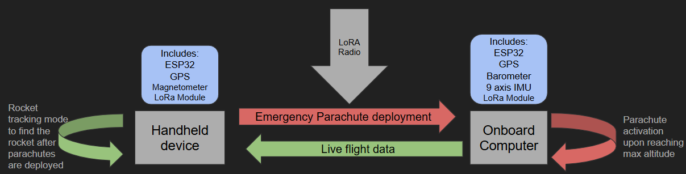
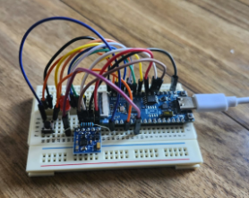
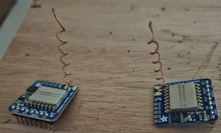
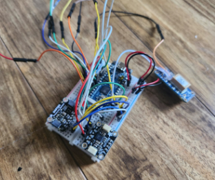
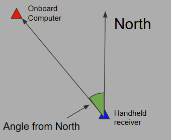

## Avionics for rocket

Although commercially available, rocket avionics have one main issue: lack of customization. Sometimes a specific rocket needs to collect different kinds of data and deploy stages based on different conditions other than time, acceleration, altitude, or other common triggers. This project focuses on making a cheap, customizable rocket avionics system that can be easily used and modified for different needs.

::: {.grid}
::: {.g-col-6}
**Handheld receiver and Tracker:**
The red LED will blink faster the closer you are pointing to the direction of where the rocket is. 

:::
::: {.g-col-6}
**Radio Modules**
These modules now have LoRa designed antennas, meaning that the gain is much better. These antennas should work at a range of 10 miles, but it is currently not tested.

:::
::: {.g-col-6}
**Onboard Computer**
The red LED is to see the signals that would activate the parachute deployment. The purpose of this board is to send data, save data, and receive deployment orders from the handheld receiver.

:::
::: {.g-col-6}
**How does the tracker work?**
The receiver will need 3 data points: GPS of rocket, GPS of itself, and Magnetometer data. This means that you can calculate the angle between where the rocket is and where the receiver is and check how closely it matches the magnetometer data, changing the blinking frequency.

:::
:::

**Future development in the project:**
Although the project has gotten very good progress in data transmission, it is still missing to have everything soldered in a more permanent board. Most of the systems, other than the back and forth data transmission, have only been tested individually, this leaves the integration of these systems as another task. Currently, I am working in making a phone application that makes tracking easier.